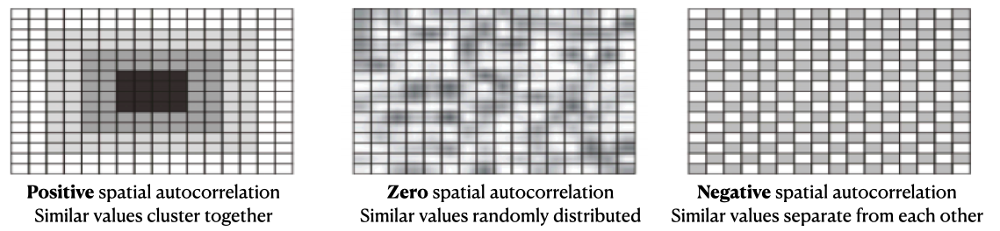
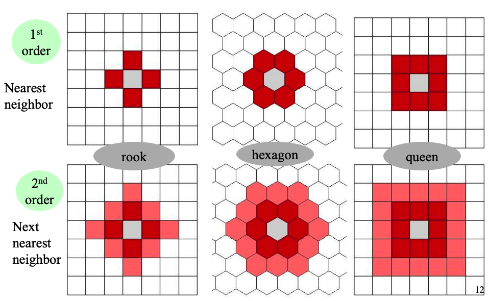
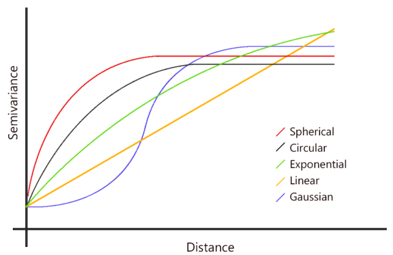

```{r setup, include=FALSE}
knitr::opts_chunk$set(echo = TRUE, warning = FALSE)
```

# Load packages

Besides `Seurat`, we need to import some useful packages. 

- `dplyr` and `ggplot2` are part of `tidyverse`, a readable and flexible R 
language for solving data science challenges. I personally prefer the coding 
style with `tidyverse`, but you may use `base R` too. 
- `patchwork` combines separate ggplots into the same graphic with easy access 
to control layouts. 
- `limma` is a `Bioconductor` package to analyze microarray data. It is not 
essential for our analysis, but may provide a more efficient implementation of 
the Wilcoxon rank sum test in differential expression analysis. 

```{r library, echo = TRUE, results='hide', message=FALSE}
library(Seurat)
library(dplyr) # data manipulation
library(ggplot2)
library(patchwork)
# install.packages('BiocManager')
# BiocManager::install('limma')
# library(limma) # optional
```

# Seurat object

We first load one spatial transcriptomics dataset into Seurat, and then 
explore the `Seurat` object a bit for single-cell data storage and manipulation. 
One 10X Genomics Visium dataset will be analyzed with `Seurat` in this tutorial, 
and you may explore other dataset sources from various sequencing technologies, 
and other computational toolkits listed in this [(non-exhaustive) resource spreadsheet](https://docs.google.com/spreadsheets/d/1nVv8siuENa9R2YR_4ghkwucLSRHaqw-9o3BFhKQ-VnU/edit?usp=sharing).  

## Download one 10X Genomics Visium dataset and load it into `Seurat`

A spatial gene expression dataset of mouse brain serial section 2 
(Sagittal-Posterior) collected by Space Ranger 1.1.0. will be analyzed throughout 
the tutorial. Both the **gene expression matrix** and **spatial imaging data** 
are necessary for the computational analysis. 

For illustration purposes, I have downloaded them from [10x Genomics](https://support.10xgenomics.com/spatial-gene-expression/datasets/1.1.0/V1_Mouse_Brain_Sagittal_Posterior_Section_2), and uploaded them to Google Drive. Alternatively, you can download 
the same files directly from 10x Genomics, or explore other spatial gene 
expression datasets out there.

The data files we will be using today include:

- a (filtered) feature / cell matrix HDF5 file (.h5)
- a spatial imaging data folder (.tar.gz)

```{r load-data, warning = FALSE}
# specify your working directory
root_dir <- "~/Downloads" 
setwd(root_dir)
# url prefix to download files
url_prefix <- "https://drive.google.com/uc?export=download&id="
# url IDs are extracted from Google Drive
spatial_folder_id <- "13B6ulZwz9XmWBD1RsnTHTMn3ySgIpFCY"
h5_mat_id <- "1nnch2ctksJ4rXYG5FzlPh3bIgnylTicV"
# file names
spatial_folder_name <- "/V1_Mouse_Brain_Sagittal_Posterior_Section_2_spatial.tar.gz"
h5_mat_name <- "/V1_Mouse_Brain_Sagittal_Posterior_Section_2_filtered_feature_bc_matrix.h5"

# Construct the wget command
wget_command <- paste0("wget --no-check-certificate 'https://drive.google.com/uc?export=download&id=", h5_mat_id, "' -O ", root_dir, h5_mat_name)
# Execute the wget command
system(wget_command)

wget_command <- paste0("wget --no-check-certificate 'https://drive.google.com/uc?export=download&id=", spatial_folder_id, "' -O ", root_dir, spatial_folder_name)
# Execute the wget command
system(wget_command)


# # download files from the resource URL to a destination path where the file is saved 
# download.file(url = paste0(url_prefix, spatial_folder_id), 
#               destfile = file.path(spatial_folder_name))
# download.file(url = paste0(url_prefix, h5_mat_id), 
#               destfile = file.path(h5_mat_name))
# extract (or list) contents from the tar archives
untar(tarfile = paste0(root_dir, spatial_folder_name), 
      exdir = path.expand(root_dir))
untar(paste0(root_dir, spatial_folder_name), list = TRUE)  # list contents

# Load a 10x Genomics Visium Spatial Experiment into a Seurat object
brain_data <- Seurat::Load10X_Spatial(
  # The directory contains the read count matrix H5 file and the image data in a subdirectory called `spatial`. 
  data.dir = root_dir, 
  filename = h5_mat_name,
  assay = "Spatial", # specify name of the initial assay
  slice = "slice1", # specify name of the stored image
  filter.matrix = TRUE, 
  to.upper = FALSE
)

brain_data
```

## Explore the `Seurat` object

A `Seurat` object serves as a container that contains both data (like the count 
matrix) and analysis (like dimension reduction or clustering results) for a 
single-cell dataset.

### Dimension of the active assay

Extract the dimension of the active assay using `dim`, `nrow`, or `ncol`.

```{r object-info}
dim(x = brain_data) # the number of features (genes) by samples (spots)
```
```{r, results='hide'}
nrow(x = brain_data) # the number of features
ncol(x = brain_data) # the number of samples
```

### Feature and sample names

Extract the feature and sample names using `rownames` or `colnames`.

```{r}
head(x = rownames(brain_data), n = 5)
```
```{r, results='hide'}
tail(x = colnames(brain_data), n = 5)
```

### Sample-level metadata

**Sample-level metadata** is stored as a `data.frame`, where each row correspond 
to one sample (e.g. cell or spot) and each column correspond to one sample-level 
metadata field. It can be accessed via `[[` extract operator, the `meta.data` 
object, or the `$` sigil (`$` extracts one single column at a time). Row names 
in the metadata need to match the column names of the counts matrix.

```{r sample-metadata}
class(brain_data[[]])
colnames(brain_data[[]]) # automatically calculated while creating the Seurat object
head(brain_data@meta.data)
brain_data$nCount_Spatial[1:3]
# nFeature_Spatial: the number of unique genes in each sample
sum(brain_data$nFeature_Spatial ==  colSums(brain_data@assays$Spatial@counts > 0))
# nCount_Spatial: the total number of detected molecules in each sample
sum(brain_data$nCount_Spatial ==  colSums(brain_data@assays$Spatial@counts))
```

### objects(e.g. `Assay`) together with feature-level metadata

```{r}
# A vector of names of associated objects can be had with the names function
# These can be passed to the double [[ extract operator to pull them from the Seurat object
names(x = brain_data)
brain_data[['Spatial']] # equivalent to: brain_data@assays$Spatial
brain_data[['slice1']] # equivalent to: brain_data@images$slice1
```

Each `Seurat` object consists of one or more **Assay** objects (basis unit of 
`Seurat`) as individual representations of single-cell expression data. Examples 
of the *Assay* objects include `RNA`, `ADT` in CITE-seq, or `Spatial`. Each *Assay* 
stores multiple slots, including raw (`counts`), normalized (`data`) and scaled 
data (`scaled.data`) as well as a vector of variable features (`var.features`) 
and feature-level metadata (`meta.features`). 

```{r}
brain_data@assays$Spatial@counts[5:10, 1:3]
```
**Feature-level** metadata is associated with each individual assay. Feature-level 
metadata can be accessed through the double bracket `[[` extract operator on the 
Assay objects, or the `meta.features` slot.

```{r, eval = FALSE}
brain_data[['Spatial']]@meta.features
head(brain_data[['Spatial']][[]])
```

Other objects containing the single-cell data analysis results will be discussed 
later after going through the analysis pipeline.


# Analysis pipeline in Seurat

The general steps to perform preprocessing, dimensiona reduction and clustering 
for spatial transcriptomics data are quite similar to the `Seurat` workflow 
analyzing single-cell RNA sequencing data. 

## Preprocess data

A standard preprocessing workflow includes the selection and filtration of cells 
based on quality control (QC) metrics, data normalization and (optional) scaling, 
and the detection of highly variable features.

### Quality control

A few common **QC metrics** include

- The number of unique genes detected in each sample (`nFeature_Spatial`).
- The total number of molecules detected within a sample (`nCount_Spatial`).
- The percentage of reads that map to the mitochondrial genome.

```{r QC, warning = FALSE}
brain_data[["percent.mt"]] <- PercentageFeatureSet(brain_data, 
                                                   pattern = "^mt-")
VlnPlot(
  brain_data, features = c("nFeature_Spatial", "nCount_Spatial", "percent.mt"), 
  pt.size = 0.1, ncol = 3) & 
  theme(axis.title.x = element_blank(),
        axis.text.x = element_blank(),
        axis.ticks.x = element_blank())

# Jointly (rather than separately) consider the QC metrics when filtering
plot1 <- FeatureScatter(
  brain_data, feature1 = "nCount_Spatial", feature2 = "percent.mt") + NoLegend()
plot2 <- FeatureScatter(
  brain_data, feature1 = "nCount_Spatial", feature2 = "nFeature_Spatial") +
  NoLegend()
plot1 + plot2

brain_subset <- subset(
  brain_data, 
  subset = nFeature_Spatial < 8000 & nFeature_Spatial > 1000 & 
    nCount_Spatial < 50000 & percent.mt < 30)

print(paste("Filter out", ncol(brain_data) - ncol(brain_subset), 
            "samples because of the outlier QC metrics, with", ncol(brain_subset),
            "samples left."))
```

### Normalization

The variance of molecular counts expresses spatial heterogeneity which cannot be 
solely explained by technical noise. Satija Lab and Collaborators recommends 
normalization using `SCTransform` ([Hafemeister and Satija, 2019](https://genomebiology.biomedcentral.com/articles/10.1186/s13059-019-1874-1#citeas)) 
in order to account for technical bias while preserving true biological differences. 

```{r, warning = FALSE}
SpatialFeaturePlot(
  brain_subset, features = c("nFeature_Spatial", "nCount_Spatial", "percent.mt")) &
  theme(legend.position = "bottom")  
brain_norm <- SCTransform(brain_subset, assay = "Spatial", verbose = FALSE)

names(brain_norm)
dim(brain_norm@assays$SCT@counts) 
dim(brain_norm@assays$SCT@data) 
dim(brain_norm@assays$SCT@scale.data) 
```

`SCTransform` returns the `Seurat` object with a new assay called `SCT`, where 
its `counts` slot stores the corrected UMI counts, the `data` slot stores the 
log-normalized version of the corrected UMI counts, and `scale.data` slot stores 
the pearson residuals (normalized values) and is used as PCA input.

The `scale.data` slot in output assay are subset to contain only the variable 
genes with `return.only.var.genes = TRUE` by default. 

## Downstream tasks (dimension reduction, data visualization, cluster annotation, differential expression)

```{r, warning = FALSE, message=FALSE}
brain_obj <- RunPCA(brain_norm, assay = "SCT", verbose = FALSE)
# compute K nearest neighbors (KNN)
brain_obj <- FindNeighbors(brain_obj, reduction = "pca", dims = 1:30)
# Leiden algorithm for community detection
brain_obj <- FindClusters(brain_obj, verbose = FALSE)
# PCA result is the default UMAP input, use dimensions 1:30 as input features
brain_obj <- RunUMAP(brain_obj, reduction = "pca", dims = 1:30)

plot3 <- DimPlot(brain_obj, reduction = "umap", label = TRUE) + NoLegend()
plot4 <- SpatialDimPlot(brain_obj, label = TRUE, label.size = 3) + NoLegend()
plot3 + plot4
```

The `reductions` object stores a dimensionality reduction taken out in `Seurat`; 
each slot in `reductions` consists of a cell embeddings matrix, a feature loadings 
matrix, and a projected feature loadings matrix.

```{r}
brain_obj@reductions
```

Ordinary differential expression analysis does not take spatial information into 
account, and thus it is generally applicable for both scRNA-seq data and spatial 
transcriptomics data to explore cellular heterogeneity of cell types and states. 

```{r, eval = TRUE}
# identity class of each sample
table(brain_obj@active.ident)
# find all markers of cluster 10
cluster10_markers <- FindMarkers(brain_obj, ident.1 = 10, min.pct = 0.25)
head(cluster10_markers, n = 5)
VlnPlot(brain_obj, features = c("Esr1", "Trh", "Ccn3"))
SpatialFeaturePlot(object = brain_obj, 
                   features = rownames(cluster10_markers)[1:3], 
                   alpha = c(0.1, 1), ncol = 3)
```

The following code chunk is not evaluated due to computational time constraints, 
but you are encouraged to give it a try if interested. 

```{r, eval = FALSE}
# find markers for every cluster compared to all remaining cells, 
# report only the positive ones
# this code chunk is not evaluated for now because of time constraints
brain_obj_markers <- FindAllMarkers(brain_obj, only.pos = TRUE, min.pct = 0.25, 
                                    logfc.threshold = 0.25)
brain_obj_markers %>%
    group_by(cluster) %>%
    slice_max(n = 2, order_by = avg_log2FC)
top10 <- brain_obj_markers %>%
  group_by(cluster) %>%
  top_n(n = 10, wt = avg_log2FC)
DoHeatmap(brain_obj, features = top10$gene) + NoLegend()
```

## Identify spatially variable genes

`Seurat` is able to calculate two metrics in order for the users to identify 
spatially variable genes, namely Moran's I statistic and marker-variogram. 
Spatial coordinates of the samples are incorporated to identify features with 
spatial heterogeneity in its expression. 

### Moran's I

Moran's I is a global metric measuring the correlation of gene expression values 
between local observed values and the average of neighboring values. We can interpret 
Moran's I as a spatial autocorrelation metric similar to the Pearson correlation 
coefficient in the context of spatial statistics. We can either calculate the 
z-score under normality assumption or perform permutation test to see whether we 
can reject the null hypothesis of zero spatial autocorrelation. 

\begin{align*}
\text{Moran's I} = \frac{N}{\sum_{i, j}W_{ij}}\frac{\sum_{i}\sum_{j}W_{ij}(x_i - \bar{x})(x_j - \bar{x})}{\sum_{i}(x_i - \bar{x})^2}
\end{align*}
, where $N$ is the total number of spatial location units indexed by $(i, j)$, 
and $W$ is a weight matrix to be discussed below. Recall that the Pearson 
correlation coefficient is 
\begin{align*}
r= \frac{\sum_{i=1}^{n}(x_i - \bar{x})(y_i - \bar{y})}{\sqrt{\sum_{i=1}^{n}(x_i - \bar{x})^2}\sqrt{\sum_{i=1}^{n}(y_i - \bar{y})^2}}
\end{align*}

```{r moransi, echo=FALSE, fig.align='center', fig.cap="Fig: Interpretation of Moran's I statistic, [image source](https://www.depts.ttu.edu/geospatial/center/gist4302/documents/lectures/Fall%202013/lecture6.pdf).", out.width = '100%'}

```

Our assumptions about the **spatial neighboring relationship** can be encoded 
with a weight matrix $W$, where $W_{i, j}$ can be either contiguity-based, or 
distance-based (inverse distance). For instance, the following figure illustrates 
potential cases for higher-order contiguity, when a first-order contiguity is 
determined based on the existence of a shared boundary or border. 

```{r contiguity, echo=FALSE, fig.align='center', fig.cap="Fig: Examples of contiguity-based spatial neighbors, [image source](https://www.depts.ttu.edu/geospatial/center/gist4302/documents/lectures/Fall%202013/lecture6.pdf).", out.width = '80%'}

```

```{r moransi-seurat, warning = FALSE}
brain_moransi <- FindSpatiallyVariableFeatures(
  brain_obj, assay = "SCT", 
  features = VariableFeatures(brain_obj)[1:10],
    selection.method = "moransi") 
moransi_output_df <- brain_moransi@assays$SCT@meta.features %>%
  na.exclude
head(moransi_output_df[order(moransi_output_df$MoransI_observed, decreasing = T), ])
```

```{r moransi-plot, warning = FALSE}
top_features_moransi <- head(
  SpatiallyVariableFeatures(brain_moransi, 
                            selection.method = "moransi"), 3)
SpatialFeaturePlot(brain_moransi, 
                   features = top_features_moransi, ncol = 3, alpha = c(0.1, 1)) + 
  plot_annotation(
  title = "Top 3 genes with the largest Moran's I",
  subtitle = "among 10 top variable genes for illustration purposes")

bottom_features_moransi <- tail(
  SpatiallyVariableFeatures(brain_moransi, 
                            selection.method = "moransi"), 3)
SpatialFeaturePlot(brain_moransi, 
                   features = bottom_features_moransi, ncol = 3, alpha = c(0.1, 1)) + 
  plot_annotation(
  title = "Bottom 3 genes with the smallest Moran's I",
  subtitle = "among 10 top variable genes for illustration purposes")
```

### marker-variogram

A gene-specific empirical variogram $v$ for gene $g$ can be calculated as a 
function of pair-wise distance $r$ between any two samples $i$ and $j$. A 
permutation test can be performed to see whether such variogram $v(r)$ is 
associated with the spatial distance $r$ in `trendsceek`. 

\begin{align*}
v(r) = \mathbb{E}_{\forall i, j, \text{ s.t. dist}(i, j) = r}\left[(x_i - x_j)^2\right]
\end{align*}
, where $x_i, x_j$ stand for the gene expression of gene $g$ in sample $i, j$ respectively.

```{r variogram, echo=FALSE, fig.align='center', fig.cap="Fig: Common theoretical variogram models, [image source](https://www.aspexit.com/variogram-and-spatial-autocorrelation/).", out.width = '80%'}

```

```{r variogram-seurat, warning = FALSE}
brain_variogram <- FindSpatiallyVariableFeatures(
  brain_obj, assay = "SCT", 
  features = VariableFeatures(brain_obj)[1:10],
    selection.method = "markvariogram")  
variogram_output_df <- brain_variogram@assays$SCT@meta.features %>%
  na.exclude # there are NA rows b/c we only calculated the variogram for 10 genes
head(variogram_output_df[order(variogram_output_df$r.metric.5), ])
```

The column named `r.metric.5` stores the expected values of mark-variogram at a 
given `r` (radius) value ($r = 5$ by default) when the marks attached to 
different points are independent (i.e., there is no spatial autocorrelation).

```{r variogram-plot, warning = FALSE}
top_features_variogram <- head(
  SpatiallyVariableFeatures(brain_variogram, 
                            selection.method = "markvariogram"), 3)
SpatialFeaturePlot(brain_variogram, 
                   features = top_features_variogram, ncol = 3, alpha = c(0.1, 1)) + 
  plot_annotation(
  title = "3 genes with the top spatially variable rank (by mark-variogram)",
  subtitle = "among 10 top variable genes for illustration purposes")

bottom_features_variogram <- tail(
  SpatiallyVariableFeatures(brain_variogram, 
                            selection.method = "markvariogram"), 3)
SpatialFeaturePlot(brain_variogram, 
                   features = bottom_features_variogram, ncol = 3, alpha = c(0.1, 1)) + 
  plot_annotation(
  title = "3 genes with the bottom spatially variale rank (by mark-variogram)",
  subtitle = "among 10 top variable genes for illustration purposes")
```


### Other R packages to identify spatially variable genes

- `spatialDE`
  + Bioconductor package: <https://www.bioconductor.org/packages/release/bioc/html/spatialDE.html> 
  + vignette: <https://www.bioconductor.org/packages/release/bioc/vignettes/spatialDE/inst/doc/spatialDE.html>
- `trendsceek` 
  + GitHub repository with a demo: <https://github.com/edsgard/trendsceek>
- `SPARK` together with its updated version `SPARK-X`
  + GitHub repository: <https://xzhoulab.github.io/SPARK/>
  + an analysis example: <https://xzhoulab.github.io/SPARK/02_SPARK_Example/>
- `MERINGUE`
  + GitHub repository: <https://github.com/JEFworks-Lab/MERINGUE> 
  + a vignette analyzing mouse olfactory bulb data: <https://github.com/JEFworks-Lab/MERINGUE/blob/master/docs/mOB_analysis.md>

# Convert data formats between R and Python

To convert single-cell data objects between R (e.g. `Seurat` or 
`SingleCellExperiment`) and Python (e.g. `AnnData`), you can use either `SeuratDisk`
or `sceasy`. Another option is to use `reticulate`, which could be a bit more 
involved and take more memory.

- `SeuratDisk` vignette to convert between `Seurat` and `AnnData`: <https://mojaveazure.github.io/seurat-disk/articles/convert-anndata.html>
- `sceasy` to convert single-cell datasets across different formats: <https://github.com/cellgeni/sceasy>
- `reticulate` vignette to call Python from R and convert data formats: <https://github.com/cellgeni/sceasy>

# Acknowledgements

The tutorial was inspired by the computational assignments I created together 
with Dr. Yun S. Song in a graduate course (CMPBIO 290: Algorithms for single-cell 
genomics) at University of California, Berkeley in Fall 2021, and it was largely 
based on many open-source materials, especially the [Seurat tutorials](https://satijalab.org/seurat/) from the Satija Lab. I would also like to thank Salwan Butrus for helpful feedback and suggestions.

**References**

- Seurat essential commands list: <https://satijalab.org/seurat/articles/essential_commands.html>
- Seurat GitHub Wiki: <https://github.com/satijalab/seurat/wiki>
- Luecken M. K. and Theis F. J., Current best practices in single-cell RNA-seq 
analysis: a tutorial. Mol Syst Biol (2019) (doi: <10.15252/msb.20188746>)
- Analysis, visualization, and integration of spatial datasets with `Seurat`: <https://satijalab.org/seurat/articles/spatial_vignette.html>
- `Seurat` guided clustering tutorial for scRNA-seq data: <https://satijalab.org/seurat/articles/pbmc3k_tutorial.html>

```{r, collapse=TRUE}
sessionInfo()
```
